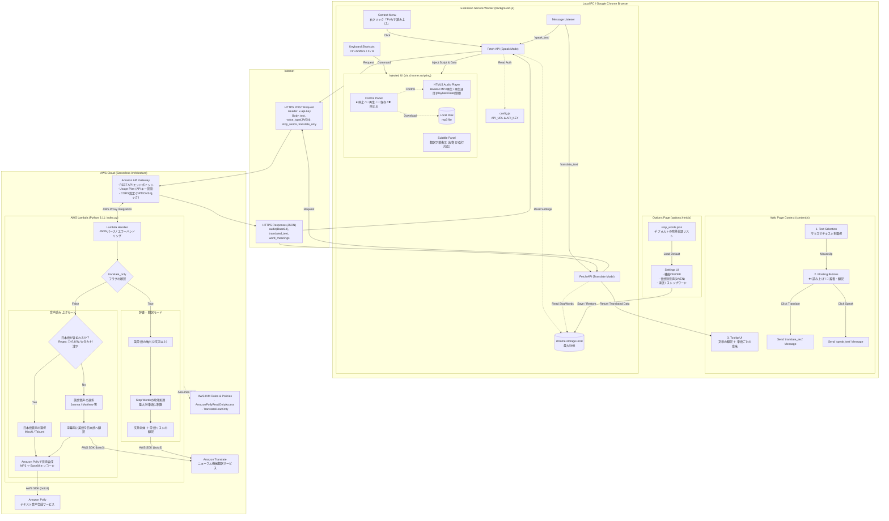

# PollyChrome
AWS Polly と AWS Translate を活用した、高機能な音声読み上げ＆翻訳 Chrome 拡張機能です。
テキストを選択するだけで、自然な音声での読み上げと、自動翻訳による字幕表示や辞書機能を提供します。

## ✨ 主な機能
- **自然な音声読み上げ**: AWS Pollyを使用した高品質なテキスト読み上げ。
- **言語ごとの音声設定**: 日本語と英語を自動で判別し、オプションで個別に設定した音声（日本語: Mizuki, 英語: Joannaなど）で読み上げます。
- **翻訳字幕の表示**: 外国語の読み上げ時に、画面下部に日本語訳を映画の字幕のように表示します。
- **辞書・翻訳ツールチップ**: わからない文章や単語を選択して「📖 辞書/翻訳」ボタンを押すと、その場で文章の翻訳と、文章内に含まれる各英単語の意味をリストアップして表示します。
- **便利なUIと操作性**:
  - ドラッグ時に出現するフローティングボタン
  - 右クリックメニューからの実行
  - カスタマイズ可能なショートカットキー（読み上げ、停止、再再生）
  - 読み上げ中のコントロールパネル（停止・再再生・mp3ファイルの保存）
- **細かなカスタマイズ**: オプション画面から、言語ごとの音声タイプ、読み上げ速度、各機能（音声・字幕・ボタン）のON/OFF、辞書機能で除外する単語（ストップワード）を自由に設定可能。

## 🏗️ システム構成
- **フロントエンド**: Chrome Extension (Manifest V3)
- **バックエンド**: AWS API Gateway + AWS Lambda (Python 3.11)
- **インフラ管理**: Terraform
- **利用AWSサービス**: Amazon Polly, Amazon Translate

### アーキテクチャ図


## 🚀 セットアップ手順

### 0. 必要なツールの準備（初心者向け）
AWSやTerraformを初めて触る方は、まず以下の準備を行ってください。すでに環境がある方は「1. バックエンド（AWS）の構築」へ進んでください。

1. **AWSアカウントの作成とアクセスキーの発行**
   - [AWS公式サイト](https://aws.amazon.com/jp/) からアカウントを作成します。
   - AWSの「IAM」コンソール画面からユーザーを作成（または IAM Identity Center を設定）し、管理者権限（`AdministratorAccess`）を付与して「アクセスキーID」と「シークレットアクセスキー」を発行・メモします。
2. **AWS CLI のインストールと初期設定**
   - AWS CLI 公式ページ からPCのOSに合ったインストーラーをダウンロードし、インストールします。
   - ターミナル（コマンドプロンプトやMacのターミナルなど）を開き、以下のコマンドを実行して先ほどのキーを登録します。
     ```bash
     aws configure
     ```
     - `AWS Access Key ID`: (発行したアクセスキー)
     - `AWS Secret Access Key`: (発行したシークレットキー)
     - `Default region name`: `ap-northeast-1` (東京リージョンの場合)
     - `Default output format`: `json`
3. **Terraform のインストール**
   - Terraform 公式ページ からPCにインストールします（Windowsなら `choco install terraform`、Macなら `brew tap hashicorp/tap && brew install hashicorp/tap/terraform` などが便利です）。
   - ターミナルで `terraform -version` と入力し、バージョン情報が表示されれば準備完了です！

### 1. バックエンド（AWS）の構築
Terraformを使用してインフラをデプロイします。AWSの認証情報（アクセスキーまたはSSO）が設定されていることを確認してください。

```bash
cd terraform
terraform init
terraform apply
```
デプロイが完了したら、出力されるAPIエンドポイントとAPIキーをメモしておきます。
```bash
terraform output -raw api_endpoint
terraform output -raw api_key
```

### 2. フロントエンド（Chrome拡張機能）の設定
設定ファイルのひな形をコピーして、実際のファイルを作成します。
```bash
cd ../extension
cp config.example.js config.js
```
`config.js` をエディタで開き、先ほど取得したAPI URLとAPIキーを貼り付けます。
```javascript
export const CONFIG = {
  API_URL: "https://xxxxxx.execute-api.ap-northeast-1.amazonaws.com/prod/speak",
  API_KEY: "YOUR_API_KEY_HERE"
};
```

### 3. Chromeへのインストール
1. Chromeで `chrome://extensions/` を開きます。
2. 右上の「デベロッパー モード」をオンにします。
3. 左上の「パッケージ化されていない拡張機能を読み込む」をクリックし、本プロジェクトの `extension` フォルダを選択します。

## 💡 使い方
1. ウェブページ上のテキストをドラッグして選択します。
2. 出現する **「🔊 読み上げ」** ボタンをクリックすると音声が再生されます。
3. **「📖 辞書/翻訳」** ボタンをクリックすると、その場で翻訳結果がツールチップで表示されます。
4. 読み上げ中に画面右下に表示されるコントロールパネルから、再生の停止・再再生、および **「💾 保存」** ボタンによる音声のmp3ダウンロードが可能です。
5. 拡張機能のアイコンを右クリックして **「オプション」** を開くと、言語ごとの声の種類の変更、速度の調整、各種機能のON/OFF、辞書機能で翻訳を除外する単語の設定（デフォルトリストの復元含む）が可能です。

## 💰 利用料金の目安（AWSコスト）
本システムはサーバーレスアーキテクチャを採用しているため、放置していても固定維持費は0円です。
また、AWSの**無料利用枠**の範囲内（個人での日常利用レベル）であれば、**ほぼ完全無料（0円）**で利用できます。

- **Amazon Polly (音声)**: 100万文字あたり 4.00 USD（最初の12ヶ月間は毎月500万文字まで無料）
- **Amazon Translate (翻訳)**: 100万文字あたり 15.00 USD（最初の12ヶ月間は毎月200万文字まで無料）
- **API Gateway + Lambda**: 100万リクエストあたり数ドル（Lambdaは毎月100万回まで永久に無料）

**【無料枠超過後のシミュレーション】**
1,000文字の英語記事を「翻訳字幕あり」で読み上げた場合でも、1回あたり**約2.8円**（※1USD=150円換算）と非常に安価です。

> ⚠️ **セキュリティに関する重要なお知らせ**
> `config.js` に記載する **APIキー** が漏洩すると、ボット等の不正利用によって高額請求が発生するリスクがあります。本プロジェクトの `.gitignore` はAPIキーを除外するよう設定されています。APIキーは絶対にGitHub等へ公開しないよう厳重に管理してください。

## 🧪 APIのテスト（オプション）
デプロイしたAPIが正常に動作するか確認するためのスクリプトです（事前に環境変数を設定してください）。

```bash
export endpoint_url="https://xxxxxx.execute-api.ap-northeast-1.amazonaws.com/prod/speak"
export test_text="こんにちは、テスト音声です。"
export api_key="あなたのAPIキー"
export output_mp3_path="test.mp3"

curl -s -X POST "$endpoint_url" \
  -H "Content-Type: application/json" \
  -H "x-api-key: $api_key" \
  -d "{\"text\": \"$test_text\"}" \
  | jq -r '.audio' | base64 -d > "$output_mp3_path"
```
